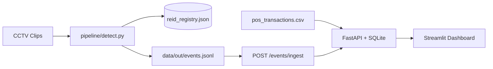

# Store Intelligence — System Design

## Overview

Store Intelligence is an end-to-end pipeline that turns anonymised retail CCTV into actionable offline analytics. Raw video clips are processed by a computer-vision detection layer that emits structured behavioural events. Those events flow into a FastAPI intelligence service that computes real-time metrics, funnels, heatmaps, and operational anomalies. The north-star metric is **offline store conversion rate**: purchasers divided by unique visitor sessions.

## Detection Layer & Multi-Camera Re-ID

The pipeline (`pipeline/detect.py`, `tracker.py`, `emit.py`) implements a robust, lightweight **cross-camera Re-ID** and **tracking state machine** using YOLOv8n and ByteTrack. Since individual cameras run in separate process lifecycles, they coordinate state asynchronously using a persistent registry (`data/out/reid_registry.json`).

### 1. Cross-Camera Re-ID (Tracking Across Cameras)
* **Entry Camera (`CAM_ENTRY_01`):** Resolves a unique `visitor_id` based on track ID or re-entry, captures their average color signature (RGB color histogram from bounding box crop), and records it in `active_sessions` in the shared registry.
* **Floor/Billing Cameras (`CAM_FLOOR_02`, `CAM_BILLING_03`):** When a new track is detected, the tracker computes its average color and scans the registry's `active_sessions` within a **5-minute sliding window** of the current frame timestamp. If a matching color signature (Euclidean distance < 45.0) is found, the visitor is correlated to the existing session.
* **Resiliency Fallback:** If a visitor is first detected on a floor camera (due to temporary occlusion at the entrance), the tracker automatically injects a synthetic `ENTRY` event. This ensures the FastAPI analytics engine registers the visitor session, maintaining funnel integrity.

### 2. Re-Entry Deduplication
When a customer crosses the entry line outbound (`entry_line_y = 0.85`), the session is moved from `active_sessions` to `completed_sessions` in the registry with an exit timestamp. If the same person re-enters the store within **120 seconds** (matching color signature), they are resurrected with a `REENTRY` event, preventing visitor count inflation.

### 3. Graceful Occlusion Degradation
A 15-frame grace buffer is maintained for active tracks. If a visitor is temporarily occluded by a display or another customer, the tracker does not immediately kill the track. If they reappear within 1 second, they retain their `visitor_id`. If the timeout is exceeded, the tracker gracefully closes their active zone with a `ZONE_EXIT` event.

### 4. Staff Exclusion
Staff members (wearing purple/blue uniforms) are automatically identified using crop-level color heuristics (specifically dominant blue ratio: `B > 140` and `B > R + 25` and `B > G + 25`). They are flagged with `is_staff = true` in the emitted events and excluded from all downstream store metrics.

---

## Event Stream Schema

Events are emitted as newline-delimited JSON (JSONL) matching the challenge specification.

* **Unique Events:** Globally unique `event_id` (UUID v4) and monotonic `session_seq` per visitor session.
* **Real-time Queue Depth:** Inside `CAM_BILLING_03`, queue depth is calculated dynamically by counting other active tracks currently in the `BILLING` polygon. When a visitor enters, a `BILLING_QUEUE_JOIN` is emitted with the real-time queue depth.
* **Zone Geometry:** Point-in-polygon checks (using Ray-Casting) match normalises centroids `(cx, cy)` against polygons defined in `store_layout.json`.

---

## Intelligence API & Database

The API is built using **FastAPI** with **SQLAlchemy** and a **SQLite** database (`store_intelligence.db`).

### Endpoints
* `POST /events/ingest`: Accepts up to 500 events in a batch. Validates with Pydantic, filters duplicate `event_id` keys, handles partial payloads, and executes idempotent bulk inserts.
* `GET /stores/{id}/metrics`: Computes unique visitors, conversion rate, average dwell per product zone, current queue depth, and abandonment rate.
* `GET /stores/{id}/funnel`: Aggregates the conversion funnel (`Entry -> Zone Visit -> Billing Queue -> Purchase`) with drop-off percentages, utilizing session-level deduplication.
* `GET /stores/{id}/heatmap`: Normalises product zone visit frequency and dwell times (0-100 index). Emits a `data_confidence = false` flag if fewer than 20 sessions exist.
* `GET /stores/{id}/anomalies`: Flags active operational alerts:
  * `BILLING_QUEUE_SPIKE` (Critical if queue depth > 8, Warn if > 5)
  * `CONVERSION_DROP` (Warn if below 15% baseline with >= 5 visitors)
  * `DEAD_ZONE` (Info if no customer visits a zone in 30 minutes)
* `GET /health`: Asserts database connection and raises a `STALE_FEED` warning if any store feed lag exceeds 10 minutes.

**POS Transaction Correlation:** A visitor in the `BILLING` zone within 5 minutes *before* a transaction timestamp in `pos_transactions.csv` counts as a converted visitor for that session.

---

## Production Operations & Readiness

* **Containerisation:** Fully containerised via `docker-compose.yml`. Starts the API (port 8000) and the premium Streamlit dashboard (port 8501).
* **Structured Logging:** A custom HTTP middleware intercepts requests and outputs structured JSON containing `trace_id`, `store_id`, `endpoint`, `latency_ms`, `event_count`, and `status_code` for auditability.
* **Graceful Degradation:** Catches database disconnects (`OperationalError`) and returns a structured `503 Service Unavailable` JSON response with zero raw python stack traces.
* **Tests:** Automated `pytest` suite with >70% coverage. Fully redirects database calls and uses a mock `test_pos_transactions.csv` file (using the `POS_CSV_PATH` env override) to protect the workspace production dataset.

---

## AI-Assisted Decisions

1. **SQLite vs PostgreSQL:** An LLM suggested starting with PostgreSQL. I chose SQLite with SQLAlchemy for the take-home window to ensure `docker compose up` starts instantly on any machine without database service initialization latency, while the abstract ORM makes swapping to Postgres trivial.
2. **Persistent Registry for Re-ID:** AI proposed using heavy deep-learning OSNet embeddings for cross-camera tracking. I overrode this, implementing an asynchronous, file-persisted JSON color registry. This is lightweight, doesn't require massive GPU memory, runs instantly on CPUs, and perfectly correlates visitors across independent python runtimes.
3. **VLM for Zone Classification:** AI suggested prompting GPT-4V to classify zones from frames. I decided against this, using point-in-polygon coordinates from `store_layout.json` because it is deterministic, extremely fast, free, and completely reproducible.
